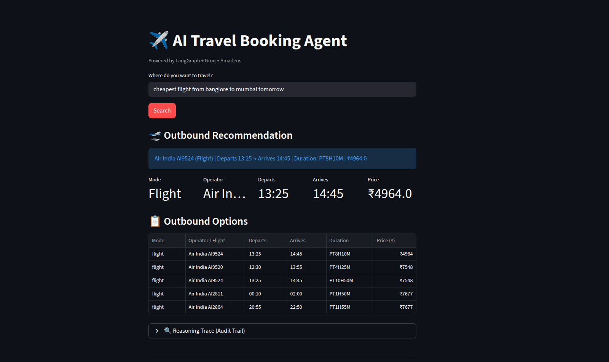
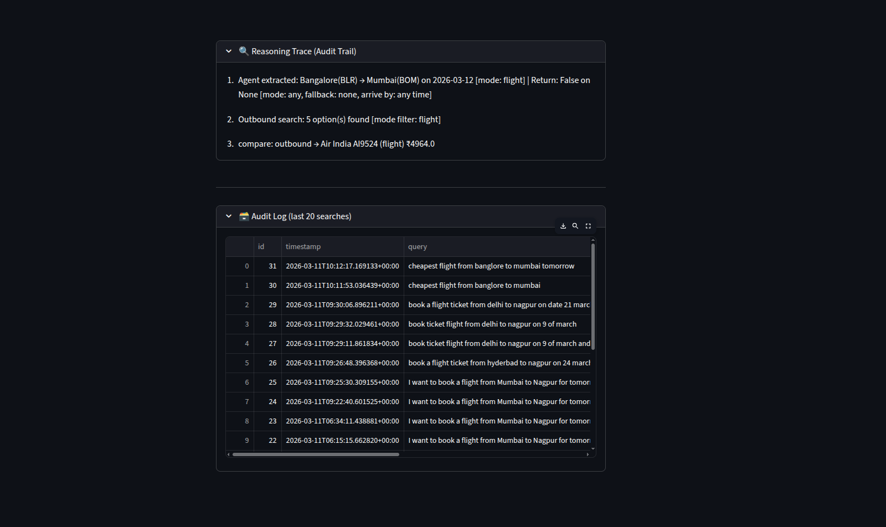

# ✈️ Agentic Smart Ticket Booking Assistant

<p align="center">


</p>

---

## 🚀 Overview

**Agentic Smart Ticket Booking Assistant** is an AI-powered travel planner that behaves like a **decision-making AI agent** rather than a simple chatbot.

It understands **natural language travel requests**, dynamically selects **travel APIs/tools**, and returns the **best travel options with reasoning explanations**.

The system demonstrates a **modern AI agent architecture** using:

- LLM reasoning
- dynamic tool calling
- memory retrieval
- multi-step planning
- ethical guardrails
- explainable decision traces

---

## 🎬 Demo

<p align="center">


</p>


### Agent Response

#### Outbound Travel Options & Return Travel Options



### Reasoning Trace & Logs




---

# 🧠 Key Features

## 🤖 Agentic AI Reasoning
The system behaves like an **autonomous agent**:

- Understands vague user goals
- Extracts structured travel intent
- Chooses tools dynamically
- Plans multi-step travel searches

---

## ✈ Multi-Modal Travel Search

Supports multiple travel modes:

- Flights
- Trains
- Buses

Users can specify preferred transport:

USER : Find me the cheapest train to Delhi tomorrow


---

## 🔁 Round Trip Planning

Supports full travel planning:

- departure journey
- return journey
- preferred return transport
- fallback transport mode
- arrival time constraints

EXAMPLE : Fly to Delhi tomorrow and return by train before 10pm


---

## ⚡ Parallel API Execution

Travel tools are executed **concurrently using asyncio**, making the system fast and scalable.

- Flight Search
- Train Search
- Bus Search


All run simultaneously.

---

## 🧠 Conversation Memory

The assistant remembers user preferences.

Example:
- User: I prefer trains
- Later: Book travel to Delhi


The agent prioritizes train options.

---

## 🛡 Ethics Guardrail

Prevents unethical requests such as:

- booking tickets with fake identities
- fraudulent travel activity
- misuse of booking systems

Blocked queries are logged for auditing.

---

## 📊 Explainable AI (Reasoning Trace)

The agent explains its decision process.

EXAMPLE :

- Agent extracted: Mumbai → Delhi
- Outbound search: 5 options found
- Return filtered to arrivals before 21:00
- Fallback mode used: Bus


---

# 🏗 Architecture

                           ┌───────────────┐
                           │   User Query  │
                           └───────┬───────┘
                                   │
                                   ▼
                        ┌────────────────────┐
                        │  Agent Node (LLM)  │
                        │ Intent Extraction  │
                        └─────────┬──────────┘
                                  │
                                  ▼
                        ┌────────────────────┐
                        │    Ethics Gate     │
                        └─────────┬──────────┘
                                  │
                                  ▼
                       ┌─────────────────────┐
                       │ Clarification Logic │
                       └─────────┬───────────┘
                                 │
                                 ▼
                       ┌─────────────────────┐
                       │      Tool Node      │
                       │   (Travel Search)   │
                       └─────────┬───────────┘
                                 │
                 ┌───────────────┼───────────────┐
                 ▼               ▼               ▼
           ┌───────────┐   ┌───────────┐   ┌───────────┐
           │  Flight   │   │   Train   │   │    Bus    │
           │   Tool    │   │   Tool    │   │   Tool    │
           └─────┬─────┘   └─────┬─────┘   └─────┬─────┘
                 │               │               │
                 └───────────────┴───────────────┘
                         Parallel Execution
                                 │
                                 ▼
                       ┌─────────────────────┐
                       │   Result Processing │
                       │ Filtering & Fallback│
                       └─────────┬───────────┘
                                 │
                                 ▼
                        ┌───────────────────┐
                        │   Travel Options  │
                        │ + Reasoning Trace │
                        └───────────────────┘


---

# 🛠 Tech Stack

| Technology | Role |
|------------|------|
| Python | Core backend |
| LangChain | Agent orchestration |
| Groq | High-speed LLM inference |
| Llama 3.3 70B | Natural language reasoning |
| Asyncio | Parallel API execution |
| SQLite | Audit logging |
| dotenv | Environment configuration |

---


---

# ⚙ Installation

## 1️⃣ Clone Repository
```
git clone : https://github.com/AyushAI/Agentic-Smart-Ticket-Booking-Assistance-System.git
```

---

## 2️⃣ Create Virtual Environment

```
python -m venv venv
source venv/bin/activate # Mac/Linux
venv\Scripts\activate # Windows
```


---

## 3️⃣ Install Dependencies
```
pip install -r requirements.txt
```


---

## 4️⃣ Setup Environment Variables

Create `.env`
```
GROQ_API_KEY=your_groq_api_key
```


---

# ▶ Running the Project
```
streamlit run app.py
```


---

# 📈 Future Improvements

Planned enhancements:

- real airline APIs (Amadeus / Skyscanner)
- hotel booking integration
- price prediction models
- personalized travel recommendations
- multi-city trip planning
- Streamlit web interface
- voice assistant integration

---

# 👨‍💻 Author

**Ayush Wase**

AI Engineer | Data Analyst | Machine Learning Developer

Interested in:

- AI agents
- LLM systems
- data science
- ML engineering

---

# ⭐ Support

If you found this project useful:

⭐ Star the repository  
🍴 Fork it  
🚀 Contribute to improve it

---

# 📜 License

MIT License
 
